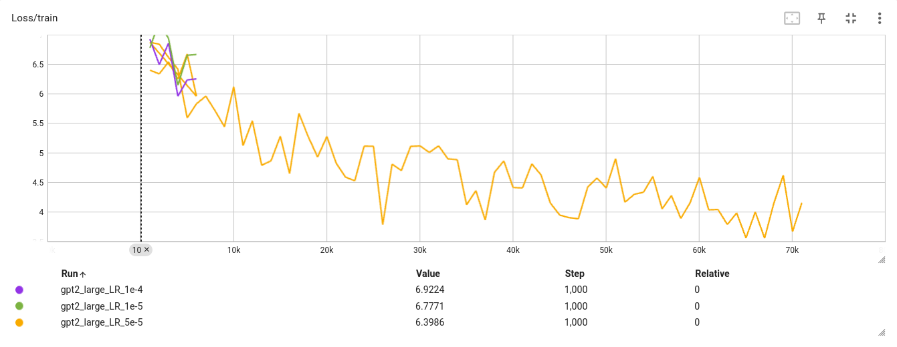
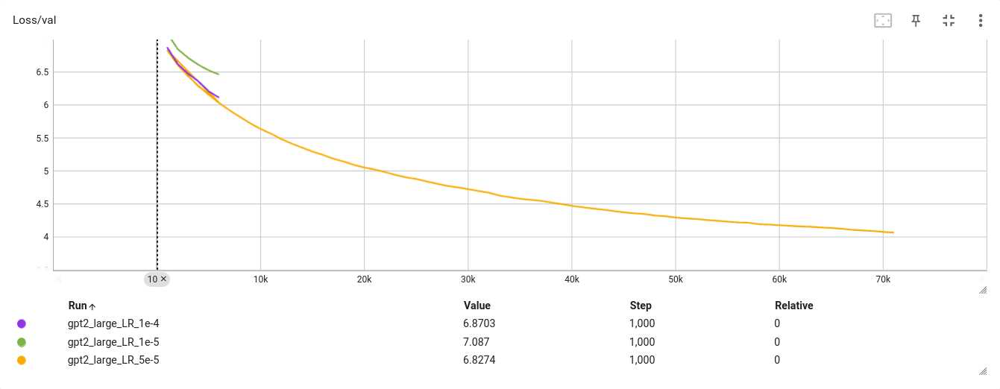

# GPT-2 Medium Training Log

## Configuration
- Training Duration: 24 hours
- Batch Size: 4
- Learning Rate: 1e-4
- Gradient Clipping: 1.0
models:
  gpt2_medium:
    context_length: 1024
    emb_dim: 1024
    n_heads: 16
    n_layers: 24
    drop_rate: 0.0
    qkv_bias: false

## Training Progress

### Training Loss


### Validation Loss


## Evaluation Results
Final validation loss: 3.38

## Sample Output
```
Fruits are good for you because fruits contain vitamin C and vitamin E.
Fruits also contain fiber, which is very important for the health of the brain and the mind.
According to the Food and Agriculture Organization (FAO) it is recommended to consume a wide range of fruits and vegetables for the health of your body and the health of your brain and the mind.
Fruits are rich in vitamins, fiber, and vitamins and are also rich in vitamins and minerals.
Fruits are rich in vitamins and fiber as
```

# GPT-2 Large Training Log

## Configuration
- Training Duration: 24 hours
- Batch Size: 2
- Learning Rate: 5.0e-5
- Gradient Clipping: 1.0
models:
  gpt2_large:
    context_length: 1024  # Maximum sequence length
    emb_dim: 1280         # Embedding dimension
    n_heads: 20           # Number of attention heads
    n_layers: 36          # Number of transformer layers
    drop_rate: 0.0        # Dropout rate
    qkv_bias: false       # Whether to use bias in query, key, and value projections

## Training Progress

### Training Loss


### Validation Loss


## Evaluation Results
Final validation loss: [Insert final validation loss here]

## Sample Output
```
Fruits are good for you because ____.
Fruits are a good way to enjoy your own health benefits.
Fruits are good for your health and will help you to improve your health.
Fruits and vegetables are good for your health.
1. Fruits are good for your health and can help you to maintain healthy blood sugar levels.
2. Fruits are good for children and adults all over the world.
3. Fruits are good for your health if they��re good for your health
```
Looks like this model generated a multiple choice question!

# Challenges and Solutions
- Issue: NaN loss
  Solution: Implemented gradient clipping with a max norm of 1.0
- Issue: Special token '<|endoftext|>' in training data
  Solution: Added `allowed_special` in the tokenization to fix it: `tokens = self.tokenizer.encode(text, allowed_special={"<|endoftext|>"})`
- Issue: Learning rate of `3e-4` seemed fine, but later found out that the learning rate should be `1e-4` led to faster convergence. I still have not tried even lower learning rates or learning rate schedules.
- Issue: Mixed Precision did not reduce GPU memory usage
  - I have not found a way to reduce GPU memory usage using mixed precision. My setup is 2 x RTX 4090 GPUs with 24GB RAM each. I have not yet tried gradient accumulation.
